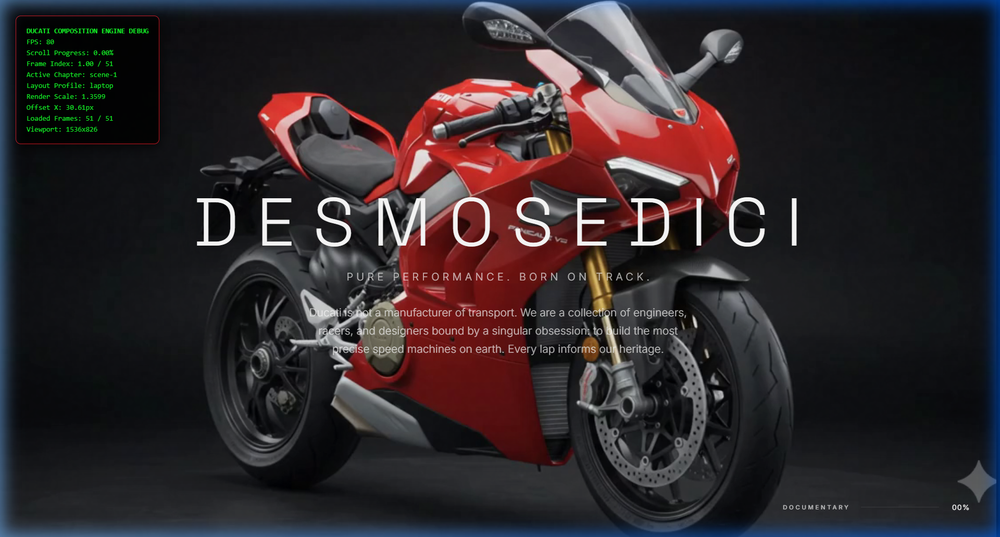
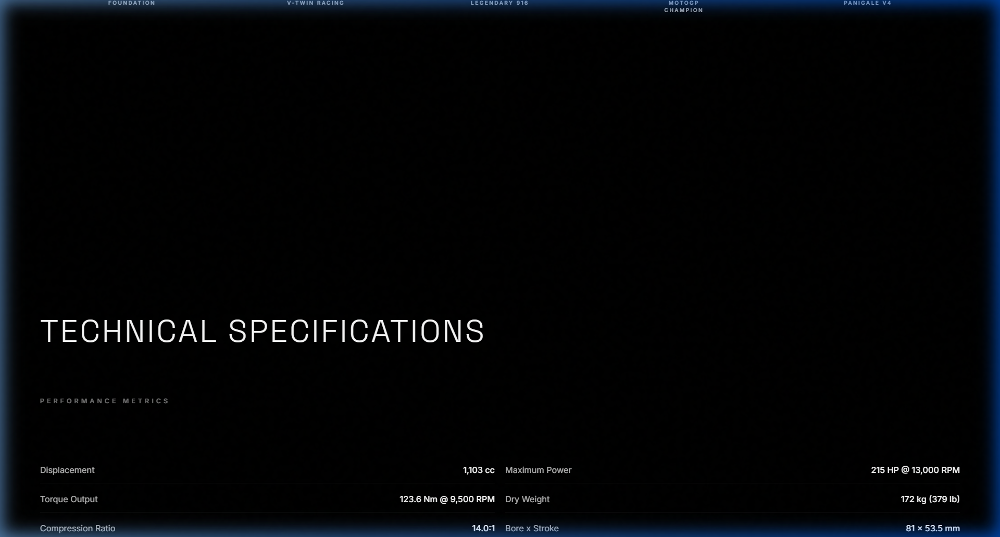
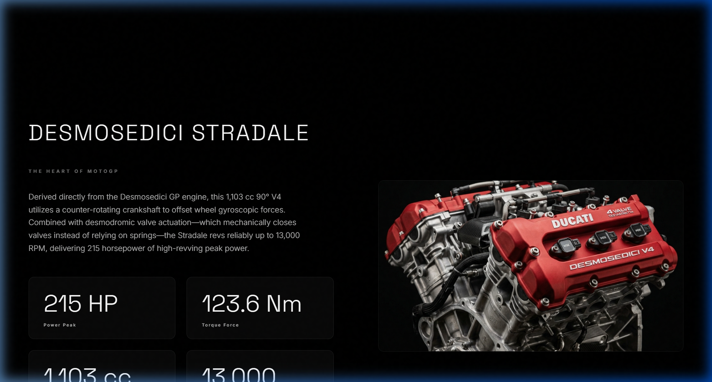

# Ducati Desmosedici V4 — Premium Interactive Scrollytelling

An immersive, highly-optimized interactive product showcase for the legendary Ducati Panigale V4. Built with high-performance canvas scrubbing, responsive composition scaling, and a luxurious magazine-style editorial layout.

[](https://vite.dev/)
[](https://gsap.com/)
[](https://vercel.com/)
[](LICENSE)

---

## 📖 Project Overview

This project was built to explore the boundaries of web-based interactive product presentations, taking design cues from premium automotive configurations and digital editorial magazines. 

Instead of traditional, marketing-heavy scroll setups loaded with text overlays, the experience is divided into **two distinct acts** that balance cinema, performance, and information:

### Act I: The Assembly (Scroll-Driven Cinematic Canvas)
A pinned, high-performance canvas sequence where the visitor controls the mechanical disassembly and reassembly of the Panigale V4. In this act, the interface is stripped of heavy UI widgets to let the motorcycle’s silhouette, dynamic lighting, and motion be the dominant storytellers. It contains three states:
1. **Opening Hero**: Bold title entrance establishing the *Desmosedici* lineage.
2. **Interactive Scroll**: A clean, distraction-free visual disassembly where frames respond continuously to scrolling speed.
3. **Specs Reveal**: A premium, minimal stats board displaying core metrics (Displacement, Power, Torque, Weight, Top Speed) on the fully assembled bike.

---

### Act II: The Anatomy (Premium Magazine Editorial)
As the visitor scrolls past the assembly stage, the canvas unpins naturally to transition into a premium editorial grid. This act delivers detailed technical articles styled as a luxury physical magazine, showcasing close-up photography, composite specifications, and mechanical breakdowns.



---

## ✨ Features

* **Scroll-Controlled Frame Scrubbing**: Crossfades and interpolates a high-resolution 51-frame render sequence.
* **Responsive Composition Engine**: Automatically determines optimal scales per device, applying safe margin checks to prevent component clipping.
* **Offset Framing System**: Positions the motorcycle off-center (`3.5%` shift right on desktop) to optimize visual weight and balance spacing.
* **Mouse Micro-Drift**: Dampened parallax coordinates that shift the canvas wrapper dynamically in response to mouse coordinates.
* **Ambient Lighting Sweeps**: Computes mouse drift to pan spotlight radial gradients, simulating studio lighting.
* **Staggered Scroll Animations**: Triggers smooth, stagger fade-ups for Act II texts using GSAP ScrollTrigger.
* **Prefers-Reduced-Motion Queries**: Detects system accessibility settings to instantly bypass scaling, speed up lerps, and reduce translation offsets.
* **Dual-Stage Image Loading**: Eager-loads the initial hero banner and lazy-loads remaining section cards, complete with `decoding="async"` overrides.
* **Performance Overlay Diagnostics**: Development overlay toggled via the `D` key or `?debug=true` query parameters.

---

## 🛠️ Architecture

The codebase separates the design system tokens, copy database, rendering engine, and scroll-triggers into modular ES Modules:

```
ducati-scrollytelling/
├── assets/                # High-resolution editorial photographs
├── frames/                # 51 cinematic motorcycle render frames
├── screenshots/           # Case study visual showcase
├── src/
│   ├── config/            # Design System Layer
│   │   ├── colors.js      # Theme hex, RGBA, and glass variables
│   │   ├── layout.js      # Occupancy margins, panning offsets, and breakpoints
│   │   ├── motion.js      # Lerps, mouse drift limits, and animation timings
│   │   ├── timeline.js    # Cinematic chapter starts and frame mapping
│   │   └── typography.js  # Typographic font clamps
│   ├── content/
│   │   └── editorial.js   # Copy database for Act II magazine layout
│   ├── engine.js          # Canvas composition and frame crossfade engine
│   ├── main.js            # Initializer, token injector, and dynamic renderer
│   ├── mouse.js           # Mouse floating and lighting sweep coordinates
│   └── timeline.js        # GSAP ScrollTrigger pinning and parallax triggers
├── index.html             # Progressive Level 1 markup & script entry
├── styles.css             # Fluid layout tokens & responsive grid styles
└── vite.config.js         # Build pipeline options
```

---

## 🚀 Technical Highlights

### Why Canvas Over Video?
Traditional HTML5 videos scrub poorly. Seeking is non-deterministic, frame jumps are choppy, and browsers buffer assets on demand. The **Canvas Rendering Engine** resolves this by caching the 51 frame images in-memory and painting them dynamically. This ensures instantaneous reaction to mouse wheels, trackpads, or mobile touch sweeps.

### Frame Crossfade Interpolation
To prevent visual stepping when scrolling quickly between frames, the engine reads fractional progress coordinates (e.g., frame `24.45`). It extracts the integer ceiling and floor frames, and draws the floor frame as the base, then overlays the ceiling frame using the fractional value as the opacity layer (`globalAlpha`). This creates a continuous blend:

```javascript
const floorFrame = Math.floor(frameIndex);
const ceilFrame = Math.min(total, floorFrame + 1);
const fraction = frameIndex - floorFrame;

ctx.drawImage(imgFloor, rx, ry, rw, rh);
if (fraction > 0.005 && imgCeil) {
  ctx.globalAlpha = fraction;
  ctx.drawImage(imgCeil, rx, ry, rw, rh);
}
```



---

## ⚙️ Engineering Challenges

### 1. Subject Clipping & Responsive Layouts
* **Problem**: Setting `object-fit: contain` on the canvas left massive black spaces on ultrawides, while vertical mobile devices cropped off critical elements like wheels, exhaust pipes, and handlebar mirrors.
* **Investigation**: Bounding boxes cannot be static. A 16:9 canvas placed inside a vertical phone viewport shifts the aspect ratio context entirely, making standard sizing fail.
* **Solution**: Developed a per-frame subject dimension tracker. When resizing, the composition engine checks the current frame's subject width/height against safety thresholds (`safeMarginX`/`safeMarginY`). If the calculated occupancy scale pushes any boundary past the safety margin, the engine overrides the target scale, resizing the canvas to fit the margins exactly (Soft Edge Protection).
* **Outcome**: Immersive visual presence across ultra-wides, standard laptops, tablets, and mobile displays without any cropping.

---

### 2. Framerate Stutters on Scroll
* **Problem**: Mapping standard window scroll offsets directly to timeline frames caused visual micro-stuttering due to mouse scroll wheel ticks or mobile thread priority halts.
* **Investigation**: Standard browsers emit scroll events at varying frequencies depending on input hardware. Direct frame updates expose these disparities.
* **Solution**: Decoupled scroll tracking from canvas rendering. The GSAP ScrollTrigger updates a target scroll progress variable. The canvas render loop runs continuously on `requestAnimationFrame`, smoothing the transition from the current render coordinate to the target progress using a Linear Interpolation (Lerp) algorithm.
* **Outcome**: A heavy, physical momentum feel on scroll sweeps that dampens erratic inputs.

---

### 3. Vercel Case-Sensitivity Build Halts
* **Problem**: Local development builds on Windows compiled successfully, but deployments on Vercel failed during the Vite build phase.
* **Investigation**: Windows filesystems are case-insensitive, allowing imports like `import { TIMELINE } from './config/Timeline.js'` to resolve files named `timeline.js` on disk. The Linux environment Vercel uses is strictly case-sensitive, causing build compiles to fail.
* **Solution**: Standardized all module filenames, directories, and configuration file references to strictly use lower-case characters.
* **Outcome**: Flawless deployment compiles on Vercel with zero path errors.

---

## 🎨 Design System & Process

The design system was constructed to evoke the premium aesthetic of a physical racing catalog:
* **Typography**: Leverages `Space Grotesk` for geometric, track-focused headings, and `Inter` for clean, readable body paragraphs. All font sizes utilize CSS `clamp()` bounds to scale proportionally with the viewport size.
* **Color System**: Focuses on a dark mode design. Grounded in Pitch Black (`#000000`) and pure whites, utilizing the signature Ducati Red (`#D4001F`) as a sparse accent color for key specs, metadata labels, and visual divides.
* **Glassmorphic Accents**: Editorial dashboards use frosted glass overlays (`backdrop-filter: blur(16px)`) with thin borders to divide content layers without breaking the background's darkness.



---

## ⚡ Performance Optimization

* **Async Pre-Decoding**: The preloader eager-loads Frame 1 to paint the landing view instantly, then loads the remaining frames asynchronously, calling `img.decode()` to cache images on the GPU in the background.
* **Asset Loading Strategy**: High-resolution Act II photographs use native `loading="lazy"` and `decoding="async"` attributes to preserve network threads for scrollytelling frames.
* **Micro-Drift Throttle**: Parallax mouse event listeners are passive and throttle coordinates to prevent layout reflows.
* **Layer Z-Indexing**: Layer z-indices are mapped once in variables to prevent overlap conflicts (`--z-canvas`, `--z-overlay`, `--z-editorial`, `--z-modal`).

---

## ♿ Accessibility

* **Reduced Motion Mode**: Automatically monitors `prefers-reduced-motion: reduce`. When active, it disables the mouse-drift camera float, skips GSAP image scale transitions, and shortens text fades to `0.3s` to avoid scrolling nausea.
* **Semantic HTML**: Conforms to semantic HTML5 standards, utilizing `<main>`, `<article>`, `<header>`, and `<footer>` containers for screen readers.
* **Color Contrast**: Main texts meet WCAG AAA requirements, rendering white typography on a pure black background.

---

## 🔧 Installation & Setup

1. **Clone the Repository**:
   ```bash
   git clone https://github.com/broskell/Ducati-Scrollytelling.git
   cd Ducati-Scrollytelling
   ```

2. **Install Dependencies**:
   ```bash
   npm install
   ```

3. **Run Local Dev Server**:
   ```bash
   npm run dev
   ```
   Open `http://localhost:3000` to preview the project locally.

4. **Compile Production Build**:
   ```bash
   npm run build
   ```
   The compiled static files will be located in the `dist/` directory, ready to serve.

---

## 🔮 Future Roadmap

* **WebGL Shader Integration**: Adding a WebGL-based film grain overlay or transition shader to enhance cinematic textures.
* **Audio Engineering**: Developing ambient sound design (low exhaust hum) that responds to scroll progress and speeds.
* **Three-Dimensional Model Viewer**: Loading a WebGL glTF model on final reassembly, letting the visitor inspect components in full 3D space.

---

## 🏆 Credits

* **Ducati Motor Holding S.p.A.**: Design, engineering, and architectural inspiration of the Panigale V4.
* **GreenSock (GSAP)**: High-performance scrolling animations and pinning utilities.
* **Vite**: Lightweight, blazing-fast bundler and dev environment.
* **Vercel**: Seamless cloud hosting and serverless deployments.

---

## 📝 Final Reflection

What began as an experiment in scroll-driven animation evolved into an exploration of visual restraint and responsive composition. By removing excessive HUD elements, progress dials, and overlay cards during Act I, we redirected focus back to the mechanical beauty of the motorcycle. The code proves that animations can be dynamic, responsive, and lightweight without compromising on premium visuals.
