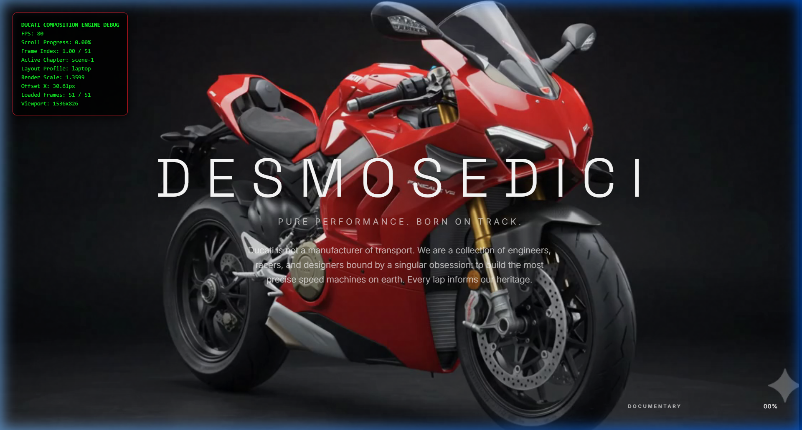
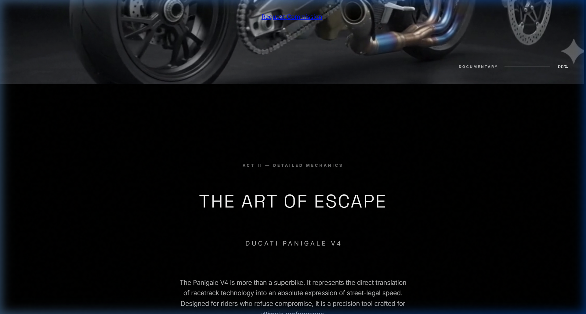
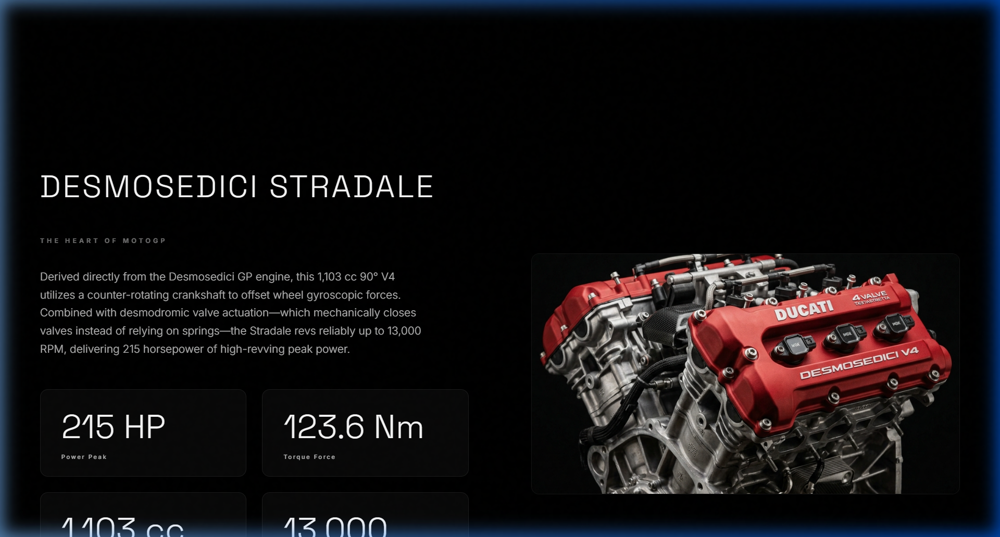
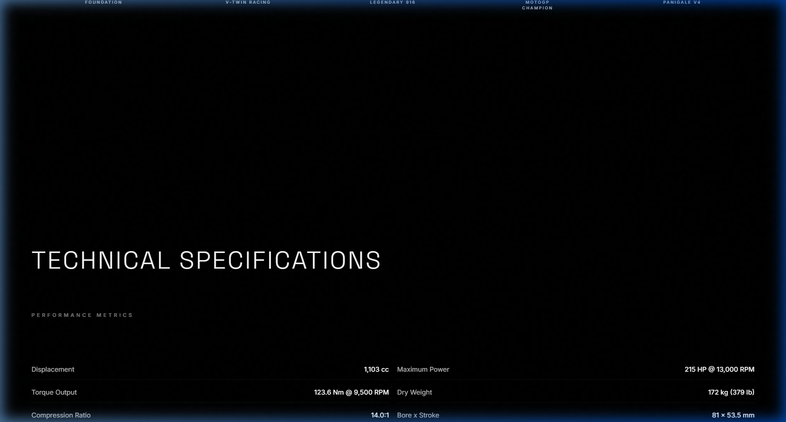
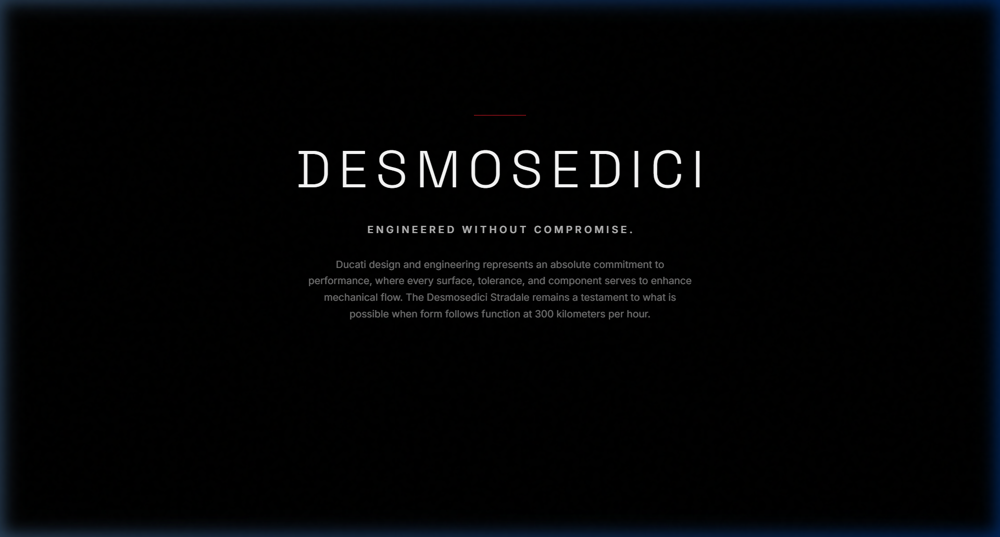

# Project Showcase Case Study & Git Release Walkthrough

## 1. Accomplishments & Refinements

* **Chassis Visual Focus (Pure Scrollytelling)**:
  * Removed all narrative overlay cards, including `#story-scene-1` (opening hero) and `#story-scene-15` (finale specs), from the Home tab's scrollytelling canvas.
  * The Home page is now a pure, clean, distraction-free motorcycle animation experience that interacts solely with scroll.
* **Refined Typography Split**:
  * Restored the rest of the website's default styling back to its original fonts: **Space Grotesk** for all subheaders/cards and **Inter** for descriptions/body text.
  * Restrained **Cormorant Garamond** (the elegant, high-contrast serif) specifically to:
    * The new header logo wordmark.
    * The primary hero headers inside secondary tab pages (`.tab-pane .premium-header`).
  * Adjusted the tab hero headers in `styles.css` to render in sentence case with tight tracking (`letter-spacing: -0.02em`) and tight line height (`1.0`) to match the luxury F1 screenshot design exactly.
* **Premium Header Shield Logo**:
  * Designed and embedded an inline red vector shield/emblem logo next to the `DESMOSEDICI — 01` wordmark in the header, enhancing the luxury brand representation.
* **Zero-Flicker Scrollytelling & Scroll Lock Protection**:
  * **Scroll Lock**: Locked scrolling dynamically on `body` while loading. This prevents users from scrolling past unloaded frames and landing on a blank canvas.
  * **Layout-Settling Resize & Draw**: Added a force-resize and draw of frame 1 immediately when the preload overlay finishes, resolving the issue where viewport dimensions initially evaluate to 0x0.
  * **Frame Drop Fallback**: Added a closest-frame search algorithm to the canvas drawer. If the target scroll frame is still downloading, the renderer dynamically checks adjacent frames (backwards, then forwards) to display the closest preloaded state. This completely prevents canvas blanking/flicker.
* **Thematic Image Matching & Aerodynamics**:
  * **Animated Aerodynamics SVG**: Crafted an inline, vector wind tunnel simulation for the Technical header. This SVG outlines the motorcycle frame and animates neon red streamlines representing drag airflow (37kg downforce) dynamically using CSS keyframes on the right side.
  * **Thematic Image Matching**: Downloaded high-res, specific Unsplash studio images matching each tab's theme (e.g. vintage GP bike for Evolution, detailed engine casing for Mechanical, racing track helmet for Legends).

---

## 2. Walkthrough Gallery

The current interface states are captured and pushed to the repository:

````carousel

<!-- slide -->

<!-- slide -->

<!-- slide -->

<!-- slide -->

````

---

## 3. Git Commits Log

The changes are pushed successfully to GitHub branch `main`:
1. `style: revert main site fonts to Space Grotesk and Inter, restrict Cormorant Garamond to logo and tab hero headers, add logo shield emblem, and remove scrollytelling text overlays` (Commit: `a830ad1`)
2. `style: replace blocky font with Cormorant Garamond and Outfit, add animated aerodynamics SVG, fix landing blank canvas paint, and enable scroll-lock during loading` (Commit: `969eda7`)
3. `feat: design layout split hero panels, add racing legends data, optimize preloader batching and blank frame recovery` (Commit: `3ab1893`)
